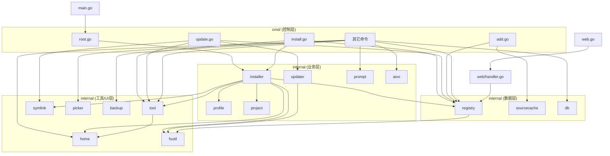

# SkillsManager (`sm`) — 项目索引

> 分形自指文档系统的根索引。当架构或目录结构变化时，请更新本文件。
> 各文件夹的细节见对应目录下的 `FOLDER_INDEX.md`，各文件的 Input/Output/Pos 见文件头注释。

## 项目概览

SkillsManager（二进制 `sm`）是一个 Go 语言编写的 CLI，是 **vercel-labs/skills**（`npx skills`）的重新实现，但核心模型是**跨项目个人 Skill Registry**（ADR 0007）：原件统一存放在 `~/.sm/registry`，项目和 Agent 通过 symlink 复用，Profile 批量部署，一次 `sm update` 更新所有可跟踪原件。模块 `github.com/woyin/skills-manager`，Go 1.26，cobra + modernc.org/sqlite（纯 Go 无 CGO）+ `//go:embed` 内嵌 Web UI。

核心心智：`sm add` 注册原件（默认 global，不安装）；`sm install <name>` 按全局唯一名称从 Registry 安装（ADR 0016）；`sm install <source>` 是 Direct Install（注册+安装的快捷路径）；`sm list` 默认显示 Registry 清单（ADR 0015）；`sm update` 默认刷新整个 Registry（ADR 0008）、`sm update --in-place` 就地刷新 copy 实体；profile 引用 Registry 中已存在的技能/MCP，一键原子化安装（ADR 0012）。

## 架构说明（分层）

```
main.go                 程序入口，仅调用 cmd.Execute
└── cmd/                控制层：cobra 子命令，用户↔internal 的唯一边界
    ├── internal/installer/   业务层：安装编排（symlink/copy/scope/MCP 合并）
    ├── internal/profile/     业务层：命名预设
    ├── internal/project/     业务层：.sm.json 项目配置
    ├── internal/prompt/      业务层：提示词模板
    ├── internal/lockfile/   业务层：skills-lock.json 可复现安装
    ├── internal/aivo/        业务层：aivo 集成
    ├── internal/registry/    数据层：技能/MCP 注册表（~/.sm/registry）
    ├── internal/db/          数据层：SQLite 状态库（安装历史/项目记录）
    ├── internal/tool/        工具层：agent 目录配置（单一来源 catalog）
    ├── internal/home/        工具层：用户 home 目录
    ├── internal/fsutil/      工具层：文件系统底层操作
    ├── internal/symlink/     工具层：符号链接操作
    ├── internal/picker/      UI 层：交互选择器
    └── internal/backup/      工具层：备份/恢复
└── web/                API 层：内嵌 Web 仪表盘（静态资源 + JSON API）
```

分层约束：`internal/registry` 是底层，不导入 `internal/tool`；特殊目录字面量在 registry 常量与 tool catalog 间保持一致（运行时映射以 tool catalog 为单一来源）。

## 目录结构

| 目录 | 职责 | 文件数 |
|---|---|---|
| [cmd/](cmd/FOLDER_INDEX.md) | 控制层：全部 cobra 子命令与编排 | 31 |
| [internal/installer/](internal/installer/FOLDER_INDEX.md) | 业务层：技能安装器（profile/registry install、scope、copy、preflight+rollback） | 1 |
| [internal/registry/](internal/registry/FOLDER_INDEX.md) | 数据层：注册表核心（增删改查、Register 原语、Origin/provenance、ref kind、git 克隆、发现、lint、MCP） | 13 |
| [internal/tool/](internal/tool/FOLDER_INDEX.md) | 工具层：agent 目录配置（单一来源 catalog） | 2 |
| [internal/db/](internal/db/FOLDER_INDEX.md) | 数据层：SQLite 状态库 | 1 |
| [internal/profile/](internal/profile/FOLDER_INDEX.md) | 业务层：profile 预设 | 1 |
| [internal/project/](internal/project/FOLDER_INDEX.md) | 业务层：.sm.json 项目配置 | 1 |
| [internal/prompt/](internal/prompt/FOLDER_INDEX.md) | 业务层：提示词模板 | 1 |
| [internal/lockfile/](internal/lockfile/) | 业务层：skills-lock.json 可复现安装 | 2 |
| [internal/aivo/](internal/aivo/FOLDER_INDEX.md) | 业务层：aivo 集成 | 1 |
| [internal/updater/](internal/updater/FOLDER_INDEX.md) | 业务层：同一来源 Registry 刷新的文件系统事务 | 1 |
| [internal/sourcecache/](internal/sourcecache/FOLDER_INDEX.md) | 数据层：远程 Git 来源缓存的获取与元数据 | 1 |
| [internal/home/](internal/home/FOLDER_INDEX.md) | 工具层：用户 home 目录 | 1 |
| [internal/fsutil/](internal/fsutil/FOLDER_INDEX.md) | 工具层：文件系统操作 | 1 |
| [internal/symlink/](internal/symlink/FOLDER_INDEX.md) | 工具层：符号链接操作 | 1 |
| [internal/picker/](internal/picker/FOLDER_INDEX.md) | UI 层：交互选择器 | 1 |
| [internal/backup/](internal/backup/FOLDER_INDEX.md) | 工具层：备份/恢复 | 1 |
| [web/](web/FOLDER_INDEX.md) | API 层：Web 仪表盘 | 1 |
| main.go | 程序入口 | 1 |

运行时数据（不在版本库）：`~/.sm/registry/`（原件）、`~/.sm/data/sm.db`（状态）、`~/.sm/data/sources/`（远程 git 源缓存）、`~/.sm/profiles/`（预设）。

## 依赖关系图



依赖方向遵循分层：`cmd → 业务/数据/工具 → 底层工具`，无循环依赖。`installer` 是业务聚合层，依赖最广；`home`/`fsutil` 是最底层叶子。

## 关键概念（领域语言摘要）

完整术语见 `CONTEXT.md`。核心区分：
- **Registry**（原件库）vs **Installed Skill**（agent 目录里的 symlink/copy 实体）
- **Register**（`sm add` 只入库，默认 global）vs **Registry Install**（`sm install <name>` 裸名称按全局唯一身份安装，ADR 0016）vs **Direct Install**（`sm install <source>` 注册+安装一步）vs **Profile Install**（`sm install --profile` 批量原子安装）
- **Skill Origin**（`.sm-origin.json` provenance：source kind / ref kind / commit，ADR 0009/0014）→ **UpdateClass**（tracking / pinned / snapshot / orphan）
- **Link Install**（symlink，跟 registry）vs **Copy Install**（`--copy`，带 origin，可 `update --in-place`）
- **Project Scope**（默认 `./<agent>/skills`）vs **Global Scope**（`--global`）
- **Remove**（`sm rm` 删 Registry 原件，有引用则拒绝，`--force` 先清安装）vs **Uninstall**（`sm uninstall` 只删 Installed Skill，ADR 0017）
- 设计决策见 `docs/adr/`（ADR-0001 ~ ADR-0017）

---
⚠️ **自指声明**: 当项目架构、目录结构或核心依赖关系变化时，请更新本索引
